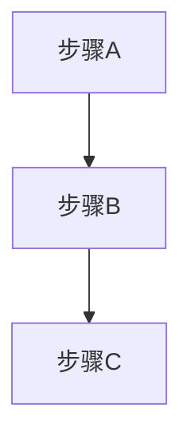
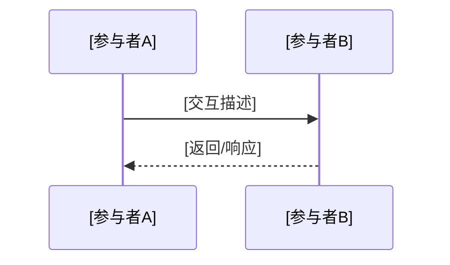
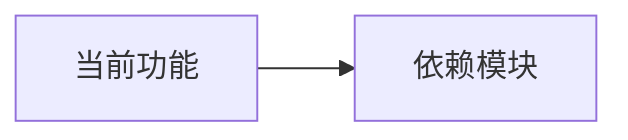

# 功能文档模板

生成文档时使用此模板，根据功能实际情况选择适用章节。

---

```markdown
# [功能名称] 技术开发文档

## 1. 功能概述

### 1.1 功能描述
[一句话描述功能作用]

### 1.2 触发条件
- **触发时机**：[描述功能触发的具体场景]
- **前置条件**：[必须满足的条件列表]
- **入口位置**：[代码文件路径]

## 2. UI 规格（如适用）

### 2.1 页面/组件结构
[使用简单 UE 线框图展示页面布局]

### 2.2 显示逻辑
| 条件 | 显示状态 | 说明 |
|------|----------|------|
| [条件1] | [状态] | [备注] |

### 2.3 样式规格
| 元素 | 尺寸 | 颜色 | 字号 | 其他 |
|------|------|------|------|------|
| [元素名] | [宽x高] | [色值] | [字号] | [圆角等] |

### 2.4 页面跳转
| 触发动作 | 目标页面 | 参数传递 |
|----------|----------|----------|
| [动作] | [目标] | [参数] |

## 3. 业务逻辑

### 3.1 执行流程
[使用 Mermaid 流程图展示业务逻辑]



### 3.2 关键步骤说明
1. **步骤1**：[详细描述]
   - 代码位置：`path/to/file.xx:行号`
   - 关键方法：`methodName()`

2. **步骤2**：[详细描述]
   ...

## 4. 数据流程

### 4.1 数据获取
- **数据源**：[描述数据来源]
- **获取方式**：[描述获取方式]
- **访问路径**：[接口地址或方法名，如适用]

### 4.2 数据结构
[描述关键数据结构，如请求/响应格式、数据模型等]

### 4.3 数据处理时序



## 5. 异常处理

### 5.1 异常场景
| 异常类型 | 触发条件 | 处理方式 | 用户提示 |
|----------|----------|----------|----------|
| [类型1] | [条件] | [处理] | [提示语] |

### 5.2 错误码说明
| 错误码 | 含义 | 处理建议 |
|--------|------|----------|
| [码] | [含义] | [建议] |

## 6. 模块依赖

### 6.1 依赖关系图



### 6.2 依赖说明
| 模块 | 作用 | 关键接口 |
|------|------|----------|
| [模块名] | [作用] | [接口名] |

## 7. 配置要求

### 7.1 配置项
| 配置文件 | 配置项 | 值 | 说明 |
|----------|--------|-----|------|
| [文件路径] | [key] | [value] | [说明] |

### 7.2 环境变量
| 变量名 | 用途 | 默认值 |
|--------|------|--------|
| [名称] | [用途] | [默认值] |

## 8. 关键代码引用

| 文件路径 | 类/方法 | 职责说明 |
|----------|---------|----------|
| `path/to/file` | `ClassName.method()` | [职责] |

## 9. 测试验证

### 9.1 功能测试点
- [ ] [测试点1]
- [ ] [测试点2]

### 9.2 边界场景
- [ ] [边界场景1]
- [ ] [边界场景2]

### 9.3 验证步骤
1. [步骤1]
2. [步骤2]
```
